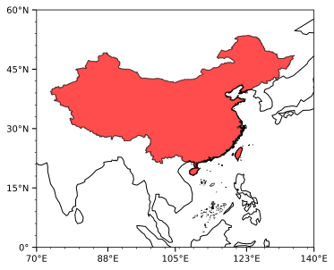
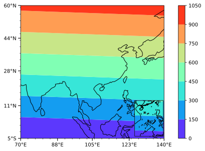

# oyl
oyl自定义的库，最为主要的用途用于画地图，除此之外，还有一些其它的个人常用功能。

## 背景
对于气象专业相关的研究人员，常需要在地图上绘制等值线，比较主流的绘制地图的库有basemap和cartopy两种。
两者在绘制地图的方式上存在一定差异，
cartopy主要是在画图轴ax的基础上加入了投影
basemap则是直接新建一个地图对象,
但随着时间的推移，basemap逐渐被淘汰，cartopy成为主流
oyl通过将加入cartopy投影的ax进行封装，创建了一个地图对象
在一定程度上能够作为逝去的basemap的替代品

## 安装
该库已发布pypi，当cartopy、xarray和sklearn已安装后，使用pip安装：
```
pip install oyl
```

## 快速上手
下面仅展示一些简单例子，更多信息，可见[tutorial](./tutorial)文件夹

### 创建底图
```python
import oyl
m = oyl.map([70, 140], [0,60]) #创建底图对象，经度自70至140，纬度自0到60
m.load_china(facecolor='red', alpha=0.7) #用透明红色加载中国底图
m.show() #查看图片
```


### 创建底图并填色
```python
import numpy as np
ds = np.arange(36*27).reshape(27, 36) #创建二维np数组用于填色
m = oyl.map([70, 140, 2], [-5, 60, 2.5]) #创建底图对象的同时，定义好填色数据的经纬度间隔
m.contourf(ds, cmap='rainbow') #用彩虹色绘制等值线
m.small_map([0.795, 0, 0.2, 0.3]) #在指定位置(0.795, 0)绘制小地图，小地图大小是(0.2,0.3)
m.load_province() #加载省份信息
m.contourf(ds, cmap='rainbow', cbar=False) #填色小地图，同时声明不加色标cbar=Flase
m.show()
```


### 其它功能
nn模块包含少量自定义的神经网络,使用方法与sklearn.neural_network类似。
该模块包含的算法有：
使用遗传算法搜寻的多层感知器(GA_MLP)
基于径向基函数的神经网络(RBF)
```python
from oyl.nn import GA_MLPRegressor, RBFRegressor
```
utils模块包含少量自定义函数，主要基于numpy
可以对np数组做合并或分解维度、又或是计算降水预测问题的ts、ets等各类评分
```python
from oyl.utils import combine_dim, decompose_dim, ScoreFuns
```

## 联系作者
邮箱：1439731362@qq.com
